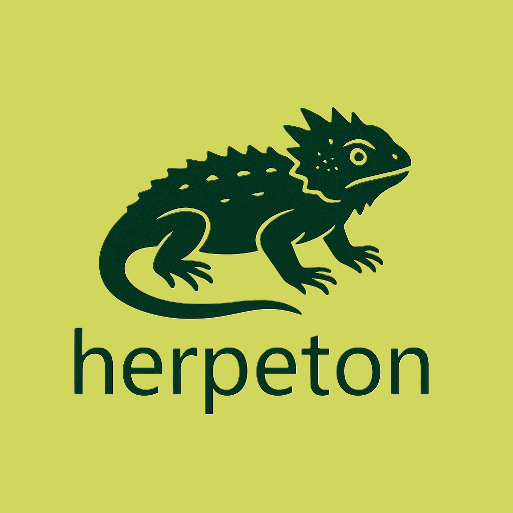

## herpeton

  

    
  

  

    
<strong>herpeton</strong> is a computer vision project focused on reptile detection, conservation, and ecological monitoring using deep learning techniques.

  

The Greek word herpeton (ἑρπετόν) means “creeping thing” or “reptile.”

It comes from the Greek verb herpein (ἕρπειν), which means “to creep” or “to crawl.”
The term reflects how these animals, such as snakes, lizards, and other reptiles, move close to the ground.

The modern word herpetology literally means “the study of creeping animals.”

# Automated Reptile Species Classification Using the BioTrove Dataset

## AAI-521: Applied Computer Vision for AI  
This project is a part of the AAI-521 course in the Applied Artificial Intelligence Program at the University of San Diego (USD). 

**Project Status:** Active (In Progress)

# Installation

# Project Introduction / Objective
The project develops a computer vision pipeline to identify **reptile species** such as snakes, lizards, turtles, and geckos from field imagery. Using the **BioTrove biodiversity dataset**, it explores how **CNNs**, **Vision Transformers (ViT)**, and **YOLOv10** can enhance conservation and biodiversity monitoring.

# Partner(s) / Contributor(s)
- Carrie Little, clittle@sandiego.edu
- Dean Simmer, dsimmer@sandiego.edu
- Omar Sagoo, osagoo@sandiego.edu

# Methods Used
- Deep Learning (CNNs, Vision Transformers)  
- Object Detection (YOLOv10 / Ultralytics)  
- Transfer Learning (ImageNet & BioTrove-CLIP)  
- Data Augmentation and Preprocessing  
- Model Evaluation & Visualization (Grad-CAM, Confusion Matrices)  
- Ethics for AI and Responsible Wildlife Applications  

# Technologies
- Python
- Google Colab / Jupyter Notebook  
- Hugging Face Datasets
- PyTorch / Ultralytics YOLOv10 
- NumPy, Pandas, Matplotlib, Seaborn
- ImageHash
- OpenCV, PIL
- TensorBoard

# Project Description

This project leverages the **BioTrove-TRAIN Reptilia subset** from the **BioTrove dataset** (Hugging Face), containing ~1.3 million labeled reptile images across 189 species.  
Images range from 224–1024 px and include taxonomy metadata (class, family, genus, species, scientific name, location).

